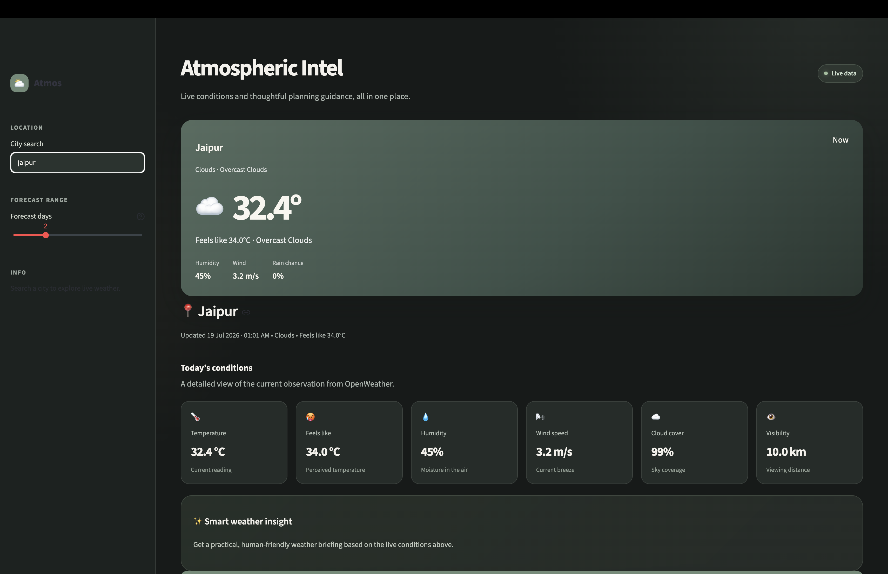
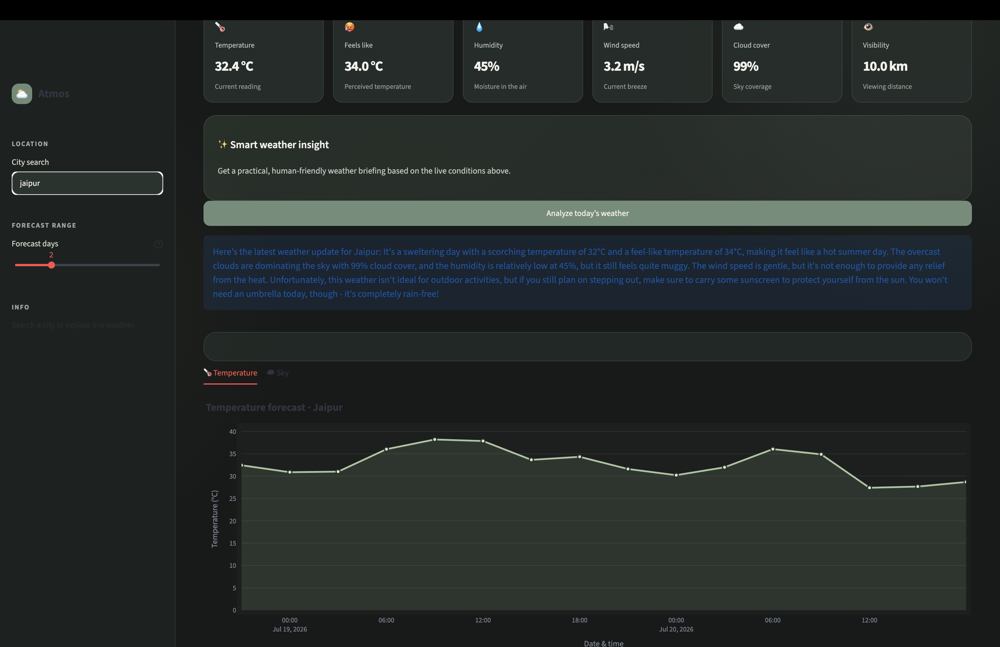

# 🌤️ Atmos

<p align="center">
  <strong>AI-Powered Weather Intelligence Dashboard</strong>
</p>

<p align="center">
  Get live weather updates, interactive forecasts, and AI-generated weather insights powered by OpenWeather, LangChain, and Groq.
</p>

## 🔗 Project Links

- **🌐 Live Demo:** https://atmosai-weather-dashboard.streamlit.app/
- **📂 GitHub Repository:** https://github.com/Tanishk7-7/ATMOS_AI-Weather-Dashboard.git

---

## 📸 Preview

### Dashboard

<p align="center">
  
</p>

### AI Weather Insight

<p align="center">
  
</p>

---

# ✨ Features

- 🌍 Search weather for any city worldwide
- 🌡️ Live current weather conditions
- 📈 Interactive temperature forecast
- ☁️ Sky forecast timeline
- 🤖 AI-powered weather insights
- 🎨 Modern responsive dashboard
- ⚡ Fast and lightweight interface
- 🔐 Secure API key management using `.env`

---

# 🛠 Tech Stack

### Frontend

- Streamlit
- HTML
- CSS

### Backend

- Python

### AI

- LangChain
- Groq (Llama 3.1 8B Instant)

### APIs

- OpenWeather API

### Visualization

- Plotly

---

# 📂 Project Structure

```text
Atmos/
│
├── front.py
├── back.py
├── images/
│   ├── clear.png
│   ├── cloud.png
│   ├── rain.png
│   ├── snow.png
│   ├── dashboard.png
│   └── ai-summary.png
│
├── .env.example
├── requirements.txt
└── README.md
```

---

# 🚀 Installation

## Clone the repository

```bash
git clone https://github.com/your-username/Atmos.git
cd Atmos
```

## Install dependencies

```bash
pip install -r requirements.txt
```

## Create a `.env` file

```env
GROQ_API_KEY=your_groq_api_key
OPENWEATHER_API_KEY=your_openweather_api_key
```

## Run the application

```bash
streamlit run front.py
```

---

# 🧠 How It Works

1. Enter the name of any city.
2. OpenWeather API fetches live weather and forecast data.
3. The dashboard displays:
   - Current weather
   - Forecast charts
   - Sky forecast timeline
4. LangChain sends the weather data to Groq's Llama 3.1 model.
5. The AI generates a natural-language weather summary with practical recommendations.

---

# 💡 Future Improvements

- 🌅 Sunrise & Sunset information
- 🌫️ Air Quality Index (AQI)
- 📍 Automatic location detection
- 📱 Improved mobile responsiveness
- 🎨 Dynamic weather-based themes

---

# 📦 Deployment

The application can be deployed easily on:

- Streamlit Community Cloud
- Render
- Railway

---

# 👨‍💻 Author

**Tanishk Hinduja**

- GitHub: https://github.com/Tanishk7-7
- LinkedIn: https://www.linkedin.com/in/tanishk-hinduja-710175346/

---

## ⭐ Support

If you found this project useful or interesting, consider giving it a ⭐ on GitHub.

It helps others discover the project and supports future development.

---

<p align="center">
Made with ❤️ using Python, Streamlit, LangChain, Groq & OpenWeather
</p>